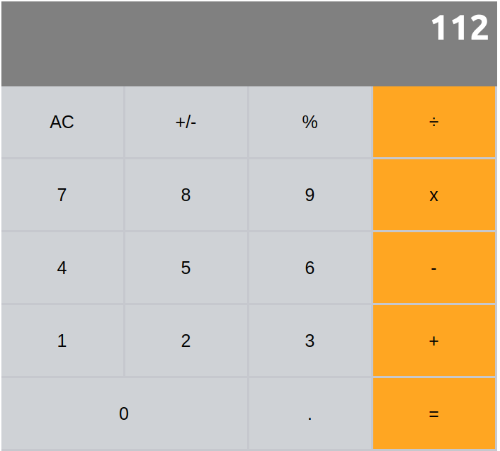

# Calculator App 
Calculator app built with React for the Math-magicians Inc



## Tools used
* Node.js
* React
* React-DOM
* React-Create-App
* npm
* CSS
* ES6

## Run Locally
To get a local copy up and running follow these simple example steps.

```bash
git clone https://github.com/Abdusaid10/calculator-app
cd calculator-app
```
> Install dependencies
```bash
npm install
```
> Build project
```bash
npm build
```
> Run Locally
```bash
npm start
```
### `npm start`

Runs the app in the development mode.<br />
Open [http://localhost:3000](http://localhost:3000) to view it in the browser.

The page will reload if you make edits.<br />
You will also see any lint errors in the console.

### `npm build`

Builds the app for production to the `build` folder.<br />
It correctly bundles React in production mode and optimizes the build for the best performance.

The build is minified and the filenames include the hashes.<br />


## Author

-[Abdusaid Abdurasulov](https://github.com/Abdusaid10)

## Contributing
Contributions, issues and feature requests are welcome!

Feel free to check the issues page.

## License
This project is [MIT](https://github.com/Abdusaid10/calculator-app/blob/master/LICENSE) licensed.